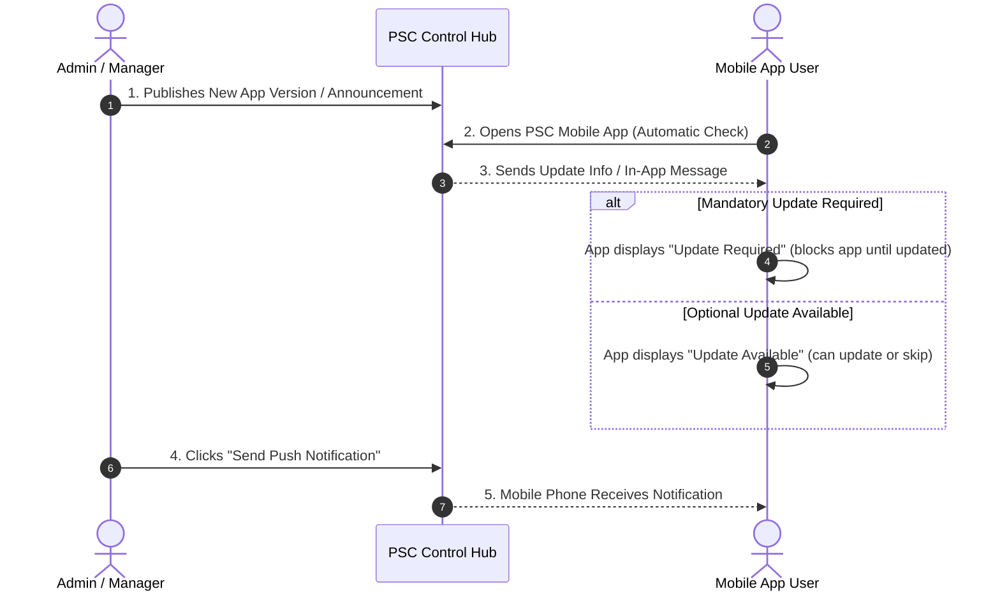

# PSC Central App Update & Announcement Hub
## Non-Technical Overview & User Guide

> [!NOTE]
> This document is designed specifically for **non-technical stakeholders, product managers, business operations teams, and system administrators**. It explains what the system does, why it exists, and how to manage mobile app updates, announcements, and push notifications without technical jargon.

---

## 1. Executive Summary

The **PSC Central App Update & Announcement Hub** is a single control center for all PSC mobile applications (including *PSC Notes*, *PSC Calendar*, *PSC Savings*, *PSC Inventory*, and any future PSC apps).

Instead of managing each mobile application separately or relying on complex deployment procedures for minor announcements, this system allows non-technical team members to manage app updates, force critical security fixes, send targeted push notifications, and display in-app messages—all from **one easy-to-use web dashboard**.

```
                           ┌────────────────────────┐
                           │   Admin Web Dashboard   │
                           │  (Managers & Admins)   │
                           └───────────┬────────────┘
                                       │ Manage Apps, Releases,
                                       │ Notifications & Messages
                                       ▼
 ┌───────────────────────────────────────────────────────────────────────────┐
 │                   PSC Central Update & Announcement Hub                   │
 └──────┬──────────────────────┬──────────────────────┬──────────────────────┘
        │                      │                      │
        ▼                      ▼                      ▼
┌───────────────┐      ┌───────────────┐      ┌───────────────┐
│   PSC Notes   │      │ PSC Calendar  │      │  PSC Savings  │  ... & Future Apps
└───────────────┘      └───────────────┘      └───────────────┘
```

---

## 2. Core Capabilities & Business Value

### 🚀 1. Universal Multi-App Management
- **Single Source of Truth:** Manage all PSC mobile apps in one place.
- **Zero-Code App Expansion:** Adding a new PSC app to the ecosystem requires **no software updates or code changes**. An administrator can register a new app in under a minute directly from the dashboard.

### 🔄 2. Smart App Version Control
- **Optional Updates:** Gently notify users when a new version or feature is available. Users can tap "Update Now" or dismiss the prompt and continue using their app.
- **Mandatory (Forced) Updates:** Essential when an older app version has a critical security flaw or is incompatible with updated servers. The system automatically restricts access on older versions and guides the user to update before continuing.
- **Direct File Hosting & Store Links:** Distribute installation files (Android APKs) directly through secure download links or redirect users to official app stores (Google Play Store / Apple App Store).

### 📢 3. In-App Announcements & Banners
- **No-Code Messaging:** Display banner notices or full-screen popup messages inside specific apps.
- **Scheduled Display:** Set start and end dates for announcements (e.g., "Planned Server Maintenance on Saturday from 2 PM to 4 PM") so they automatically appear and disappear without manual intervention.

### 🔔 4. Targeted Push Notifications
- **App-Specific Broadcasts:** Send push notification alerts directly to users' phones when a new release is published or an urgent notice needs attention.
- **Partitioned Messaging:** Notifications sent to *PSC Notes* users will never be sent to *PSC Calendar* users.
- **Duplicate Protection:** Safety mechanisms prevent accidental double-sending of notifications.

### 🔒 5. Enterprise Security & Access Control
- **Role-Based Web Access:** Access to the web portal is protected by secure user logins and optional Email OTP (One-Time Password) verification.
- **Safe & Private Downloads:** Installation files uploaded to the server are protected with temporary, secure download links.

---

## 3. How the System Works (In Plain Language)



1. **Daily Mobile App Startup:** When a user opens any PSC app on their phone, the app silently checks the PSC Control Hub in the background.
2. **Instant Status Evaluation:** The hub compares the version on the user's phone with the rules set in the Admin Dashboard.
3. **User Prompt:** If an update or announcement is active, a friendly prompt appears on the user's screen with release notes and a single-tap update button.

---

## 4. Visual Guide to the Admin Dashboard

The web dashboard is divided into key operational sections accessible from the navigation bar:

| Dashboard Page | Purpose & What You Can Do |
| :--- | :--- |
| **📊 Overview (`index.html`)** | View system summary metrics (Total Active Apps, Total Published Releases, Notifications Sent, and Recent Request Activity). |
| **📱 Applications (`applications.html`)** | View and add PSC mobile apps (e.g., PSC Notes, PSC Savings). Configure app keys, display names, and target platforms. |
| **🚀 Releases (`releases.html`)** | Create draft releases, set version numbers, write release notes for users, set minimum required version, upload APK files, and publish updates. |
| **🔔 Push Notifications (`notifications.html`)** | Compose and broadcast push notification messages to mobile app users, preview messages, and view notification delivery logs. |
| **📜 Activity & Access Logs (`logs.html`)** | Track system usage, monitor update check traffic from mobile devices, and audit administrative actions. |
| **👥 Admin Users (`admins.html`)** | Manage team access to the web dashboard, create administrative accounts, and assign user roles. |

---

## 5. Common Workflow Walkthroughs

### Workflow A: Publishing a New App Update

1. **Log In** to the Admin Dashboard.
2. Navigate to **Releases** and click **Create Release**.
3. Select the target **Application** (e.g., *PSC Notes*) and **Platform** (Android or iOS).
4. Fill in:
   - **Version Number:** (e.g., `1.2.0`)
   - **Minimum Supported Version:** If set higher than an existing version (e.g., `1.1.0`), users running anything older will be forced to update.
   - **Release Notes:** Plain-language summary of new features and fixes.
   - **Installation File / Link:** Upload the APK file or paste the App Store URL.
5. Click **Save as Draft** to review, or **Publish Immediately**.
6. *(Optional)* Click **Send Push Notification** next to the release to notify users on their mobile devices.

### Workflow B: Adding a Brand-New PSC App

1. Navigate to **Applications**.
2. Click **Add Application**.
3. Enter:
   - **App Name:** (e.g., `PSC Inventory`)
   - **App Key:** Unique short identifier (e.g., `psc_inventory`)
   - **Package Name / Bundle Identifier:** (e.g., `com.psc.inventory`)
4. Click **Create Application**. The mobile development team can now connect the new app immediately without backend changes!

### Workflow C: Setting Up an In-App Maintenance Notice

1. Navigate to **Announcements** (or In-App Messages).
2. Click **New Announcement**.
3. Select the target app or select *All Apps*.
4. Enter the message headline (e.g., "Scheduled Server Maintenance") and details.
5. Choose whether the message is dismissible or mandatory.
6. Set the **Start Date** and **End Date** for the notification display window.
7. Save the announcement.

---

## 6. Frequently Asked Questions (FAQ)

#### Q1: What happens if a user is offline or has poor internet connection?
**A:** The mobile app treats update checks gracefully. If the user has no internet access, the app uses its last saved state so the user can continue working without crashing or freezing.

#### Q2: What is the difference between an Optional Update and a Mandatory Update?
**A:** 
- **Optional Update:** The user gets a popup saying "Version 1.2 is available," but they can tap "Later" and keep using the app.
- **Mandatory Update:** The user gets a popup saying "This version is no longer supported," and the button forces them to download the update before they can use the app further.

#### Q3: Do we need developers to write code when launching a new PSC app?
**A:** For the backend update system, **no code is needed**. You simply create a new app record in the dashboard under the *Applications* page. (Developers will only need to add the standard two-line update package inside the new mobile app codebase).

#### Q4: Can we send push notifications to specific users only?
**A:** Notifications are targeted **per application** (e.g., all users of *PSC Calendar*). This ensures relevant communication without spamming users of other PSC apps.

#### Q5: How is security handled for installation downloads?
**A:** Installation files are stored in a private secure vault. When a user requests a download, the system generates a secure, short-lived download link that expires automatically, protecting the files from unauthorized public access.

---

## 7. Summary & Best Practices Checklist

- [x] **Keep Release Notes clear:** Write user-friendly descriptions of fixes and new features in release notes.
- [x] **Use Mandatory Updates judiciously:** Reserve mandatory updates for major security patches, data format changes, or critical bug fixes to avoid frustrating end users.
- [x] **Test Draft Releases first:** Create releases in draft mode, verify download links and descriptions, and publish when ready.
- [x] **Audit Admin Access:** Regularly review admin user accounts under *Admin Users* to ensure only active team members have access to the dashboard.
