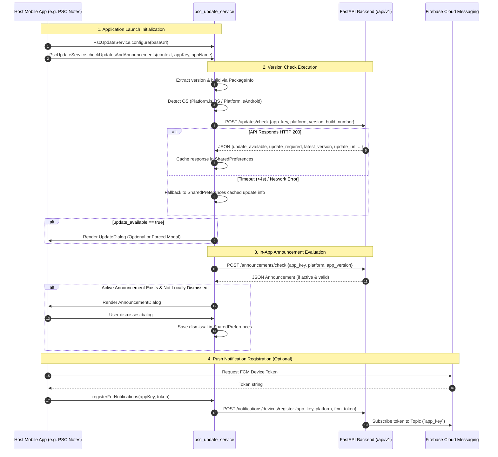
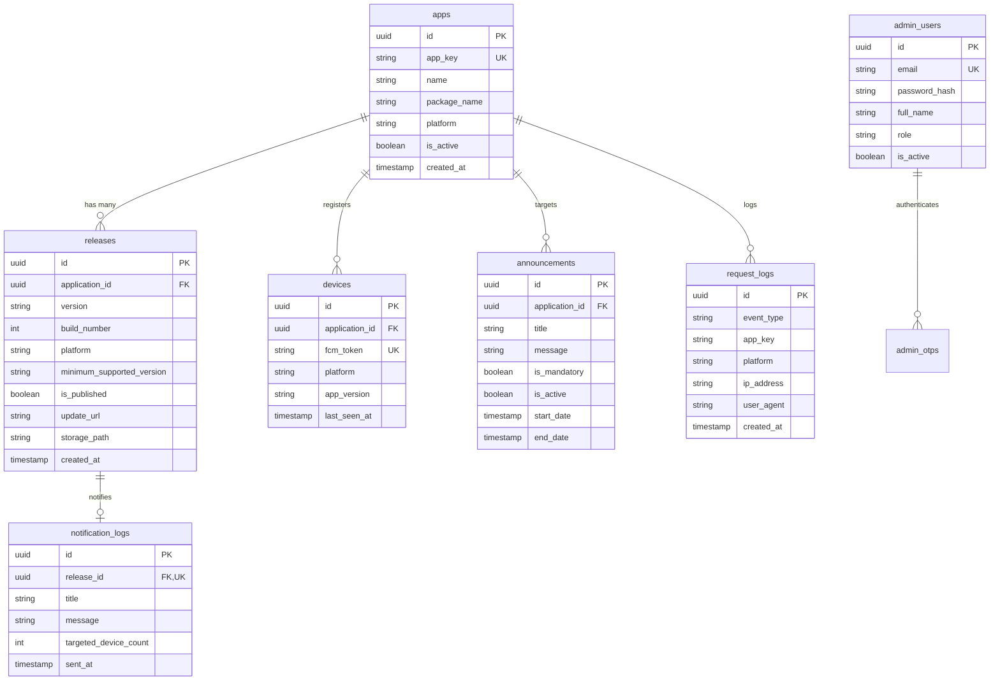

# PSC Central App Update & Announcement System
## Technical Architecture & Engineering Documentation

> [!NOTE]
> This document is engineered for **software developers, system architects, mobile engineers, DevOps practitioners, and technical reviewers**. It contains lower-level system contracts, data models, integration specifications, and security policies governing the PSC Central Version Control ecosystem.

---

## 1. System Overview & Core Architecture

The **PSC Central App Update System** is a unified microservice infrastructure designed to control app versioning, enforce mandatory upgrades, deliver in-app announcements, and dispatch targeted push notifications across all PSC mobile applications (*PSC Notes*, *PSC Calendar*, *PSC Savings*, *PSC Inventory*, etc.).

```
┌────────────────────────────────────────────────────────────────────────────────────────┐
│                                   CLIENT LAYER                                         │
│                                                                                        │
│   ┌────────────────┐    ┌────────────────┐    ┌────────────────┐    ┌──────────────┐   │
│   │   PSC Notes    │    │  PSC Calendar  │    │  PSC Savings   │    │Future PSC App│   │
│   └───────┬────────┘    └───────┬────────┘    └───────┬────────┘    └──────┬───────┘   │
│           │                     │                     │                    │           │
│           └─────────────────────┼─────────────────────┴────────────────────┘           │
│                                 │ Embedded Package: psc_update_service                 │
│                                 ▼                                                      │
│                        HTTPS / REST Requests                                           │
└─────────────────────────────────┬──────────────────────────────────────────────────────┘
                                  │
                                  ▼
┌────────────────────────────────────────────────────────────────────────────────────────┐
│                              API & SERVICE LAYER                                       │
│                                                                                        │
│   ┌────────────────────────────────────────────────────────────────────────────────┐   │
│   │                          FastAPI Gateway (Render / Docker)                     │   │
│   │                                                                                │   │
│   │  [Rate Limiter]  [Auth Guard / JWT]  [SemVer Engine]  [Audit Logger]             │   │
│   └────────┬──────────────────────────────────────┬──────────────────────┬─────────┘   │
└────────────┼──────────────────────────────────────┼──────────────────────┼─────────────┘
             │                                      │                      │
             │ service_role Key                     │ Firebase Admin SDK   │ Admin Session
             ▼                                      ▼                      ▼
┌───────────────────────────┐             ┌──────────────────┐   ┌───────────────────┐
│    Supabase PostgreSQL    │             │ Firebase Cloud   │   │  Admin Dashboard  │
│   (RLS Enabled / Locked)  │             │ Messaging (FCM)  │   │   (Static Portal) │
└───────────────────────────┘             └──────────────────┘   └───────────────────┘
```

### Architectural Guarantees & Principles

1. **Privileged Backend Boundary:** Neither client mobile applications nor the static Admin Dashboard maintain direct database connections or credentials. The backend ([`backend/app/main.py`](file:///c:/Users/user/Desktop/Personal_Projetcs/psc_version_control/backend/app/main.py)) acts as the sole bearer of the Supabase `service_role` key and Firebase credentials.
2. **Zero-Trust Storage & Data Security:** Database tables are secured via Row Level Security (RLS) with no public (`anon`) read/write policies. Supabase Storage buckets for binary releases (`.apk` / `.ipa`) are strictly private; download access is granted exclusively through short-lived, backend-signed URLs.
3. **Registry-Driven Multi-Tenancy:** Applications are dynamically registered records within the `apps` table. Features, releases, and push notifications operate against an `app_key` parameter rather than hard-coded routes.
4. **Resilient Non-Blocking Client Mechanics:** Mobile update evaluations execute asynchronously post-render, failing silently without impeding host application operation or startup.

---

## 2. Flutter Applications Connectivity & Integration Guide

All PSC Flutter applications connect to the system through a shared, reusable Flutter package located at [`flutter_package/psc_update_service`](file:///c:/Users/user/Desktop/Personal_Projetcs/psc_version_control/flutter_package/psc_update_service).

### 2.1 Connection Topology & Data Flow



### 2.2 Client Integration Protocol

Connecting a Flutter application (e.g., `PSC Notes`) requires adding the dependency to `pubspec.yaml` and invoking the initialization hooks.

#### Step 1: Dependency Specification (`pubspec.yaml`)
```yaml
dependencies:
  flutter:
    sdk: flutter
  psc_update_service:
    path: ../psc_update_service
```

#### Step 2: Global Configuration (`main.dart`)
Call `PscUpdateService.configure` prior to `runApp`:

```dart
import 'package:flutter/material.dart';
import 'package:psc_update_service/psc_update_service.dart';

void main() {
  WidgetsFlutterBinding.ensureInitialized();
  PscUpdateService.configure(
    baseUrl: 'https://psc-version-control.onrender.com',
  );
  runApp(const PscNotesApp());
}
```

#### Step 3: Lifecycle Integration (`HomeScreen.dart`)
Execute checks inside `addPostFrameCallback` to ensure the host UI context is mounted:

```dart
class HomeScreen extends StatefulWidget {
  const HomeScreen({super.key});

  @override
  State<HomeScreen> createState() => _HomeScreenState();
}

class _HomeScreenState extends State<HomeScreen> {
  @override
  void initState() {
    super.initState();
    WidgetsBinding.instance.addPostFrameCallback((_) {
      _initPscServices();
    });
  }

  Future<void> _initPscServices() async {
    // 1. Run update check + in-app announcements
    await PscUpdateService.checkUpdatesAndAnnouncements(
      context,
      appKey: 'psc_notes',
      appName: 'PSC Notes',
    );

    // 2. Register FCM token for targeted push notifications
    final fcmToken = await FirebaseMessaging.instance.getToken();
    if (fcmToken != null) {
      await PscUpdateService.registerForNotifications(
        appKey: 'psc_notes',
        fcmToken: fcmToken,
      );
    }
  }

  @override
  Widget build(BuildContext context) {
    return Scaffold(
      appBar: AppBar(title: const Text('PSC Notes')),
      body: const Center(child: Text('App Content')),
    );
  }
}
```

### 2.3 Resiliency & Offline Caching Architecture

The update client ([`PscUpdateClient`](file:///c:/Users/user/Desktop/Personal_Projetcs/psc_version_control/flutter_package/psc_update_service/lib/src/services/update_client.dart)) implements an **offline-first strategy**:

- **Strict HTTP Timeout:** Requests to `/api/v1/updates/check` timeout after 4 seconds (`Duration(seconds: 4)`).
- **Exception Swallowing:** Network failures, DNS errors, and 5xx backend responses trigger an internal fallback to local cache (`_fallbackToCache()`) rather than rethrowing.
- **`SharedPreferences` Persistence:** Upon receiving a successful `200 OK` response, update flags and metadata are serialized to JSON and stored under key `psc_update_service_last_check`.
- **Non-Blocking UI Execution:** If offline and un-cached, `PscUpdateInfo.none()` is returned, ensuring app boot remains instantaneous under poor or absent cellular connectivity.

---

## 3. FastAPI Backend Microservice Architecture

The backend application built with FastAPI is located in [`backend/app/`](file:///c:/Users/user/Desktop/Personal_Projetcs/psc_version_control/backend/app).

### 3.1 Module Organization

```
backend/app/
├── api/
│   └── v1/
│       ├── announcements.py   # In-app announcement endpoints
│       ├── apps.py            # Application management API
│       ├── auth.py            # Admin login & OTP authentication
│       ├── downloads.py       # Direct download landing page & signed URLs
│       ├── logs.py            # Audit & request activity log endpoint
│       ├── notifications.py   # FCM registration & topic broadcasting
│       ├── releases.py        # Release management & binary upload
│       └── updates.py        # Public update-check endpoint
├── core/
│   ├── config.py             # Pydantic environment configuration
│   ├── database.py           # Supabase client instantiation
│   └── security.py           # JWT generation & password hashing (bcrypt)
├── services/
│   ├── announcement_service.py # In-app message logic
│   ├── fcm_service.py          # Firebase Cloud Messaging topic dispatch
│   ├── notification_service.py # Database notification auditing
│   ├── release_service.py      # Release querying & binary storage upload
│   └── version_service.py      # Semantic version parsing & comparison
└── main.py                     # FastAPI app initialization, middleware, routes
```

### 3.2 Semantic Versioning Engine

String comparisons fail for semver strings (e.g., `"1.10.0" < "1.9.0"` evaluates to `true` lexically).

The semantic versioning service ([`version_service.py`](file:///c:/Users/user/Desktop/Personal_Projetcs/psc_version_control/backend/app/services/version_service.py)) parses version strings into numeric tuples:

$$\text{VersionTuple} = (M, m, p, S)$$

Where:
- $M$: Major version integer
- $m$: Minor version integer
- $p$: Patch version integer
- $S$: Pre-release tag priority index (e.g., `dev` < `alpha` < `beta` < `rc` < `final`)

#### Version Comparison Algorithm (`check_for_update`)

Given client version $V_{\text{installed}}$ and release $R$ with version $V_{\text{release}}$ and minimum supported version $V_{\text{min}}$:

1. **`update_available` flag:**
   $$\text{update\_available} = (V_{\text{release}} > V_{\text{installed}})$$

2. **`update_required` flag:**
   $$\text{update\_required} = (V_{\text{installed}} < V_{\text{min}})$$

This decouple permits setting a higher $V_{\text{min}}$ on an existing release to enforce immediate mandatory updates across older clients without requiring a new binary release.

### 3.3 Storage & Direct APK/IPA Binary Downloads

Binary assets uploaded via `POST /api/v1/releases/{id}/upload` are stored in the private Supabase bucket `app-builds`.

1. **Storage Path Mapping:** `builds/{app_key}/{platform}/{release_id}/{filename}`
2. **Download Link Signing:** When clients request a download page (`/download/{app_key}?platform=android`), the backend calls Supabase Storage API `create_signed_url` with an expiration duration (default 3600 seconds).
3. **Brand Page:** Renders a responsive HTML landing page (`backend/app/templates/download.html`) that triggers auto-download while displaying release notes.

---

## 4. Supabase Database Schema & Isolation Model

Database state is governed by migrations in [`supabase/migrations/`](file:///c:/Users/user/Desktop/Personal_Projetcs/psc_version_control/supabase/migrations).



### 4.1 Schema Definitions & Migrations

| Migration Script | Primary Purpose | Key Database Changes |
| :--- | :--- | :--- |
| `001_init_schema.sql` | Base Schema | Creates `apps`, `releases`, `admin_users`, `devices`, `notification_logs`. Enables RLS on all tables. |
| `002_make_release_update_url_optional.sql` | Release Versatility | Makes `releases.update_url` nullable to allow binary file hosting. |
| `003_request_logs.sql` | Audit Middleware | Introduces `request_logs` table for tracking device check IPs & user-agents. |
| `004_in_app_announcements.sql` | Messaging Engine | Adds `announcements` table for non-FCM in-app alerts. |
| `005_simplify_announcements.sql` | Announcement Rules | Streamlines announcement fields and active date range constraints. |
| `006_app_builds_storage.sql` | Private Storage Bucket | Registers private `app-builds` storage bucket and file metadata columns on `releases`. |
| `007_security_hardening.sql` | Row-Level Lock Down | Explicitly revokes all public/anon table permissions and enforces service-role access. |
| `008_admin_otp.sql` | 2FA / OTP Verification | Adds `admin_otps` table with TTL constraints for email one-time passcode login. |

---

## 5. Security Architecture & Threat Model

```
                    SECURITY BOUNDARY
┌────────────────────────────────────────────────────────┐
│ PUBLIC INTERNET (Untrusted)                            │
│                                                        │
│  Flutter Apps / Browsers                               │
│  - No DB credentials                                   │
│  - No FCM Admin keys                                   │
└──────────────────────────┬─────────────────────────────┘
                           │ Rate-Limited HTTPS REST
                           ▼
┌────────────────────────────────────────────────────────┐
│ FASTAPI SERVICE (Trusted Enclave)                      │
│                                                        │
│  - Holds SUPABASE_SERVICE_ROLE_KEY                     │
│  - Holds FIREBASE_CREDENTIALS_JSON                     │
│  - Executes JWT validation (HS256)                     │
│  - Sanitizes inputs & masks 500 errors                 │
└──────────────────────────┬─────────────────────────────┘
                           │ Authenticated Service Access
                           ▼
┌────────────────────────────────────────────────────────┐
│ SUPABASE POSTGRESQL & STORAGE (Isolated)               │
│                                                        │
│  - Row Level Security (RLS) ENABLED ON ALL TABLES      │
│  - Zero policies for `anon` / `authenticated` roles    │
│  - `app-builds` bucket private (signed URLs only)       │
└────────────────────────────────────────────────────────┘
```

### Security Controls Summary

1. **No Client Database Access:** Mobile clients never possess direct Supabase connection keys or database credentials.
2. **Strict JWT Bearer Authentication:** Admin API endpoints (`/api/v1/apps`, `/api/v1/releases`, `/api/v1/notifications/send`) require HTTP Bearer authorization headers containing valid JWT tokens issued by `/api/v1/auth/login`.
3. **Database RLS Enclosure:** Migration `007_security_hardening.sql` locks down Supabase:
   ```sql
   ALTER TABLE apps ENABLE ROW LEVEL SECURITY;
   ALTER TABLE releases ENABLE ROW LEVEL SECURITY;
   -- No SELECT/INSERT/UPDATE policies granted to anon
   ```
4. **Duplicate Notification Protection:** `notification_logs.release_id` contains a `UNIQUE` database constraint, preventing double-click or race condition push broadcasts for a single release.
5. **Rate Limiting & Exception Obfuscation:** Public endpoints (`/updates/check`, `/notifications/devices/register`) employ rate limiting. Unhandled internal exceptions return a generic HTTP `500 {"detail": "Internal server error"}` to prevent data leaking.

---

## 6. End-to-End API Specification Reference

### 6.1 Public Endpoints (Client Facing)

#### `POST /api/v1/updates/check`
- **Purpose:** Called on mobile app startup to evaluate version state.
- **Request Body:**
  ```json
  {
    "app_key": "psc_notes",
    "platform": "android",
    "version": "1.0.0",
    "build_number": 1
  }
  ```
- **Response (Update Available):**
  ```json
  {
    "update_available": true,
    "update_required": false,
    "latest_version": "1.1.0",
    "latest_build": 2,
    "minimum_supported_version": "1.0.0",
    "title": "New Version Available",
    "message": "PSC Notes 1.1.0 includes performance enhancements.",
    "release_notes": ["Added cloud sync", "Fixed layout bugs"],
    "update_url": "https://psc-version-control.onrender.com/download/psc_notes?platform=android"
  }
  ```

#### `POST /api/v1/announcements/check`
- **Purpose:** Fetches active in-app banner/dialog notices.
- **Request Body:**
  ```json
  {
    "app_key": "psc_notes",
    "platform": "android",
    "app_version": "1.0.0"
  }
  ```

#### `POST /api/v1/notifications/devices/register`
- **Purpose:** Registers an FCM token and subscribes it to the app's FCM topic.
- **Request Body:**
  ```json
  {
    "app_key": "psc_notes",
    "platform": "android",
    "fcm_token": "fcm_token_string_here",
    "app_version": "1.0.0"
  }
  ```

---

## 7. Extensibility Protocol: Onboarding New PSC Apps

Adding a new PSC mobile application (e.g., `PSC Inventory` or `PSC App 5`) requires **zero backend codebase changes or service redeployments**:

1. **Dashboard Registration:**
   Navigate to the Admin Dashboard (**Applications** page) and submit a new app record:
   - `Name`: `PSC Inventory`
   - `App Key`: `psc_inventory`
   - `Package Name`: `com.psc.inventory`
   - `Platform`: `android` / `ios`
2. **Flutter Integration:**
   In the new Flutter app's codebase, add `psc_update_service` to `pubspec.yaml` and configure with `appKey: 'psc_inventory'`:
   ```dart
   PscUpdateService.configure(baseUrl: 'https://psc-version-control.onrender.com');
   PscUpdateService.checkUpdatesAndAnnouncements(context, appKey: 'psc_inventory', appName: 'PSC Inventory');
   ```
3. **Release Publishing:**
   Create and publish releases for `psc_inventory` directly via the **Releases** page in the Admin Dashboard.

---

## 8. Deployment & Operational Operations

### 8.1 Docker Containerization

The service includes a production Dockerfile ([`backend/Dockerfile`](file:///c:/Users/user/Desktop/Personal_Projetcs/psc_version_control/backend/Dockerfile)):

```dockerfile
FROM python:3.11-slim
WORKDIR /app
COPY requirements.txt .
RUN pip install --no-cache-dir -r requirements.txt
COPY . .
EXPOSE 8000
CMD ["uvicorn", "app.main:app", "--host", "0.0.0.0", "--port", "8000"]
```

### 8.2 Render Deployment Blueprint (`render.yaml`)

```yaml
services:
  - type: web
    name: psc-version-control
    env: python
    buildCommand: pip install -r requirements.txt
    startCommand: uvicorn app.main:app --host 0.0.0.0 --port $PORT
    envVars:
      - key: SUPABASE_URL
        sync: false
      - key: SUPABASE_KEY
        sync: false
      - key: SECRET_KEY
        generateValue: true
```

### 8.3 Database Migration Sequence

Execute migrations sequentially in the Supabase SQL Editor:
1. `supabase/migrations/001_init_schema.sql`
2. `supabase/migrations/002_make_release_update_url_optional.sql`
3. `supabase/migrations/003_request_logs.sql`
4. `supabase/migrations/004_in_app_announcements.sql`
5. `supabase/migrations/005_simplify_announcements.sql`
6. `supabase/migrations/006_app_builds_storage.sql`
7. `supabase/migrations/007_security_hardening.sql`
8. `supabase/migrations/008_admin_otp.sql`
